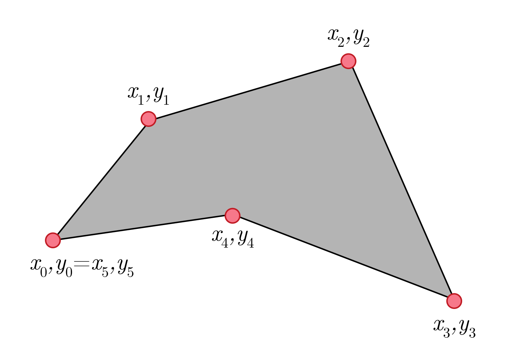

## R Packages

For this week's session, we will need the `tidyverse` and a number of other packages packages. To install new packages, we use the `install.packages()` function where the package name is written inside the parantheses in double quotes - "package name". For the "tidyverse" package, the installation function would look like this:

```{r}
install.packages("tidyverse")
```

To work specifically with spatial data, we need the `rgdal` and `rgeos` packages installed.

```{r}

```

You will need to load the `rgdal` package to work with spatial data, but `rgeos` just needs to be installed and not explicitly loaded. So, we'll use the `library()` function to load `rgdal`:

```{r}
library("rgdal")
```

Now load the `ggplot2` and `broom` packages, which are both part of the `tidyverse`:

```{r}

```

We recommend loading `tidyverse` packages individually as opposed to using the omnibus `library("tidyverse")` function. This makes your code more explicit and the dependencies clearer for replication purposes.

## Importing Tabular Data 

This semester, we'll destinguish among two different broad types of data: tabular and geometric. Tabular data are the data we are used to working with - they look like spreadsheets with variables saved in columns and observations saved in rows. We typically store characteristics of places we want to map in tabular data sets.

Up until this point, we've used the data available in the `stlData` package, but in order to work on your own data, you will need to import it into `R`. For these purposes, the best file type to have your data saved in is `.csv`. We'll practice importing data with two of the `stlData` data sets, which have been made into `.csv` files. The `stlInsurance` data is saved in this week's repository in a file named `stlInsurance.csv`:

```{r}
insurance <- read.csv("stlInsurance.csv", stringsAsFactors = FALSE)
```

Pay close attention to the structure of the code above. We've assigned the data in the `csv` file to an object named `insurance`. We use the `read.csv()` function to do this. You *must* place the filename in quotes.

Now try making an object named `lead` from the `stlLead.csv` file containing the lead data.:

```{r}

```

There are a wide variety of tools in a number of different `R` packages for working with other common types of data, including Microsoft Excel files, Acccess databases, other types of databases like SQL databases, and even Google Sheets. However, we *strongly* recommend storing your file in non-proprietary, plain-text `.csv` files whenever possible.

## Basic plots with `ggplot2`

`R` offers many ways of making sophisticated plots, including the package `ggplot2`. We will use this package (already loaded as part of `tidy verse`) to makes some plots without worrying too much about the syntax of the commands. For more information on `ggplot2`, see Wickham (2015). 

### Histograms

The basic `ggplot` call requires the assignment of a dataframe ('insurance') and an aesthetic variable to an object named `pctUnins`. The second line also calls the specific type of plot we want to make as a "geom". In this case, we'll use the `geom_histogram()`. The `binwidth = val` can be adapted as needed to adjust the appearance of the plot. Note that we call the object `pctUnins` afterwards to display it.

```{r}
pctUnins <- ggplot() +
  geom_histogram(data = insurance, mapping = aes(x=pctUnins), binwidth = 2)
pctUnins
```

Now try making a histogram for the `pctElevated` variable in the `lead` dataframe. 

```{r}


```

### Saving plots 

To save the plots we have made, we can use the function `ggsave`, which will save the plot to our working directory. First specify the object name ('pctUnins') and then after 'file' specify the file name and type.

```{r}
ggsave(pctUnins, file = "pctUnins histogram.png")
```

## Geometric Data

We noted above that we would distinguish between two broad types of data this semester: tabular and geometric. While characteristics of places we want to map are typically stored in tabular data formats, we need other data structures to deal with the geometric data that allow us to locate our characteristics on maps.

We locate these characteristics using [cartesian coordinate systems](https://en.wikipedia.org/wiki/Cartesian_coordinate_system), some pairing of `x` and `y` coordinates that allow us to uniquely locate a place on the earth's surface. Latitude and longitude are commonly known versions of these `x` and `y` coordinates, but there are other ways to represent locations as well.

### Polygons

We are going to focus on mapping a particular type of geometric feature this semester: the polygon. While `R` can handle lots of different types of spatial data, it is particularly well suited for mapping quantitative data that measure characteristics of [polygons](https://en.wikipedia.org/wiki/Polygon). A polygon is a series of points, each known as a "vertex", that are connected by line segments. Each vertex can be described by its `x` and `y` coordinates:

```{r echo=FALSE}

```

### Drawing Polygons in ggplot2
We can draw polygons using `ggplot2`. First, we need to construct a data frame that contains a number of `x,y` coordinates, each of which is associated with an `id` number:

```{r}
dataPoly <- data.frame(
  id = c(1, 2, 3, 4, 5),
  x = c(1, 2, 4, 5, 3),
  y = c(2, 6, 7, 1, 3)
)
```

These coordinates each define a unique `x,y` pair. You can view these pairs more easily by using the `View()` function we discussed last week:

```{r}
View(dataPoly)
```

We can use the `geom_polygon()` geom function to plot these data and the `geom_point()` geom function to highlight each vertex (`x,y` coordinate combination):

```{r}
ggplot() +
  geom_polygon(data = dataPoly, mapping = aes(x = x, y = y)) +
  geom_point(data = dataPoly, mapping = aes(x = x, y = y, color = "vertex", size = 2)) + 
  theme(legend.position = "none")
```

In applied settings, we do not spend a lot of time drawing arbitrarily defined polygons. It is, however, important to understand the logic behind how `x,y` coordinates work and are interpretd by `ggplot2`.

### Census Geography

Polygons are commonly used to represent administrative divisions, such as countries, states, provinces, counties, and cities. We will spend time this semester working with what is commonly known as "Census geography" - the administrative divisions that the U.S. Census Bureau uses to map demographic data. Each county in the U.S. is subdivided into a series of polygons that cover every street address known as census tracts. Tracts have a typical population of between 1,000 and 8,000 residents with about 4,000 inhabitants on average. This is is a map of all of the census tracts in Missouri:

```{r echo=FALSE}

```

You can see that the geographical size of census tracts, because they are define by population and not area, vary widely. This is a close-up of the census tracts in the St. Louis metropolitan area:

```{r echo=FALSE}

```

In the figure above, you can make-out the City of St. Louis's boundary. Since St. Louis is an [independent city](https://en.wikipedia.org/wiki/Independent_city), the Census Bureau treats it as the equivalent of a county. 

### FIPS Codes
Each census tract can be referred to as by a unqiue identification number. The census tract we are sitting in right now for this seminar is `29510119300`.

* `29` is the state code, which refers to the State of Missouri
* `510` is the county code, which refers to the City of St. Louis
* `119300` is the census tract identification number

Together, these 11 digits comprise the FIPS code for our present census tract. We will need to reference FIPS codes as we work with spatial data this semester. These are often stored in a variabled called `GEOID` in Census Bureau data.

## Storing Geometric Data
Geometric data used in GIS applications are typically disseminated as "shapefiles". There are two shapefiles in this week's repository that contain geometric data for (1) all census tracts in Missouri and (2) only census tracts within the City of St. Louis. 

Shapefiles are actually a collection of different files that are all named **exactly** the same. Each of these files stores a piece of important data that GIS software applications can use to render the polygons stored within. For example, the `missouriTract` shapefile in this week's repository consists of the following files:

* `missouriTract.cpg`
* `missouriTract.dbf`
* `missouriTract.prj`
* `missouriTract.shp`
* `missouriTract.shp.ea.iso.xml`
* `missouriTract.shp.iso.xml`
* `missouriTract.shp.xml`
* `missouriTract.shx`

For the second shapefile, `stlTract`, there is a different combination of files:

* `stlTract.dbf`
* `stlTract.prj`
* `stlTract.qpj`
* `stlTract.shp`
* `stlTract.shx`

Shapefiles all must have one each of the following file types: `.dbf`, `.shp`, and `.shx`. These three files contain the core components needed for plotting. It isn't important at this stage to understand exactly what each of these files does, only that they are all needed to varying degrees and that they must have the **exact** same names.

## Reading Geometric Data in R
We use the `rgdal` package to read shapefiles into `R`. These data must be in the **top-level** of your `R` project directory. To import our `missouriTract` shapefile, we use the `readOGR()` function. We need to specify `dsn = "."` for each use of the function, and the layer should match the name of your shapefile:

```{r}
import <- readOGR(dsn = ".", layer = "missouriTract")
```

Once imported, these data will appear under the "Values" section of the global environment as an object named `import`. However, they are not in a data frame structure. We need to use the `broom` package's `tidy()` function to disaggregate these data and store them in a data frame:

```{r}
missouriTract <- tidy(import, region = "GEOID")
```

If you open up your tidied data using the `View()` function, you'll see that there is a row for each vertx on each polygon for every census tract in the state (there are A LOT of points!):

```{r}
View(missouriTract)
```

Now, you try importing the data from the `stlTract` shapefile using the `readOGR()` function into the `import` object. Then tidy them using the `tidy()` function and save the output into an object named `stlTract`. You are combining the two code chunk above (skip the `View()` code chunk) into a single code chunk:

```{r}

```

## Plotting Census Tracts

We can create simple maps of just the census tracts using `ggplot2` and the `geom_polygon()` function we introduced above:

```{r}
ggplot() +
  geom_polygon(data = missouriTract, mapping = aes(x = long, y = lat)) 
```

Now try plotting just the census tracts in St. Louis using the `stlTract` data:

```{r}

```

